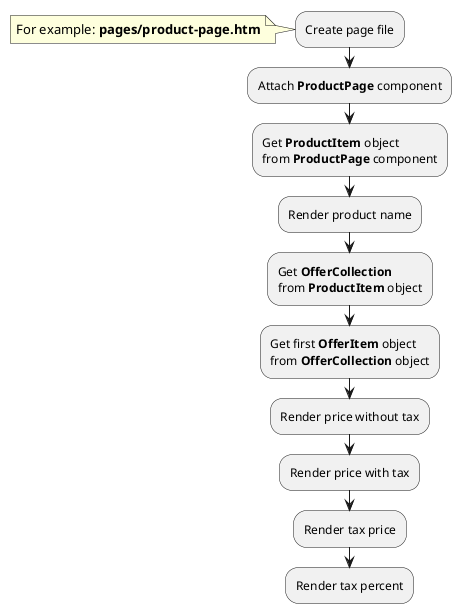
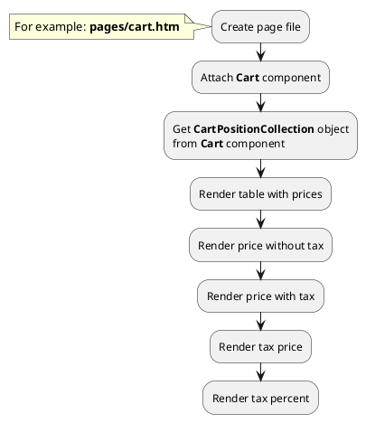
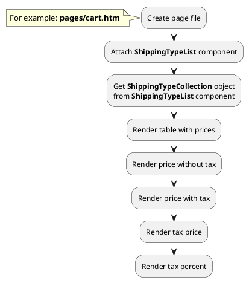




* [Example 1: Render tax price of offers](#example-1-render-tax-price-of-offers)
* [Example 2: Render tax price of cart positions](#example-2-render-tax-price-of-cart-positions)
* [Example 3: Render tax price of shipping type](#example-3-render-tax-price-of-shipping-type)

## Example 1: Render tax price of offers

### 1.1 Task

Create simple product page and render price block. Get the price of the first offer with tax and without tax.

### 1.2 How can i do it?

### 1.3 Source code

{{ get_module('tax').example('pages/product-page-1.htm')|raw }}

## Example 2: Render tax price of cart positions

### 2.1 Task

Create simple cart page and render price block. Get prices of cart positions with tax and without tax.

### 2.2 How can i do it?

### 2.3 Source code

{{ get_module('tax').example('pages/cart-1.htm')|raw }}

{{ get_module('tax').example('partials/product/cart-position/cart-position-1.htm')|raw }}

## Example 3: Render tax price of shipping type

### 3.1 Task

Create simple cart page and list of shipping types. Get prices of shipping types with tax and without tax.

### 3.2 How can i do it?

### 3.3 Source code

{{ get_module('tax').example('pages/cart-2.htm')|raw }}
