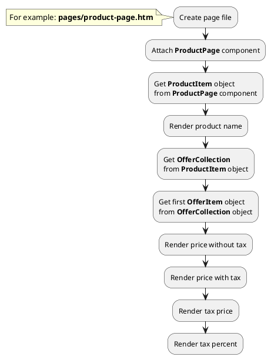




* [Example 1: Render tax price of offers](#example-1-render-tax-price-of-offers)

## Example 1: Render tax price of offers

### 1.1 Task

Create simple product page and render price block. Get the price of the first offer with tax and without tax.

### 1.2 How can i do it?

### 1.3 Source code

{{ get_module('tax').example('pages/product-page-1.htm')|raw }}
