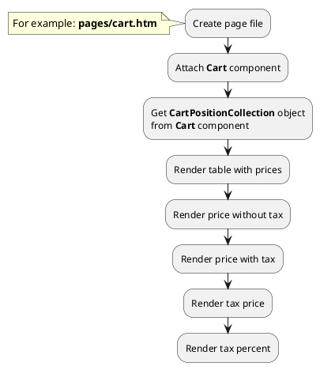

## Example {{ i }}: Render tax price of cart positions

### {{ i }}.1 Task

Create simple cart page and render price block. Get prices of cart positions with tax and without tax.

### {{ i }}.2 How can i do it?

### {{ i }}.3 Source code

{{ get_module('tax').example('pages/cart-1.htm')|raw }}

{{ get_module('tax').example('partials/cart/cart-position/cart-position-1.htm')|raw }}