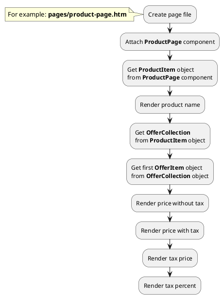

## Example {{ i }}: Render tax price of offers

### {{ i }}.1 Task

Create simple product page and render price block. Get the price of the first offer with tax and without tax.

### {{ i }}.2 How can i do it?

### {{ i }}.3 Source code

{{ get_module('tax').example('pages/product-page-1.htm')|raw }}