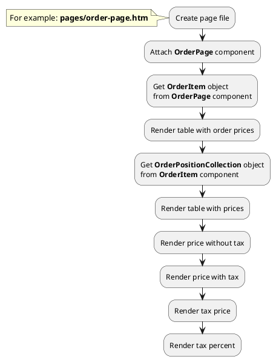

## Example {{ i }}: Render tax price of order

### {{ i }}.1 Task

Create simple order page and render price block. Get prices of order positions with tax and without tax.

### {{ i }}.2 How can i do it?

### {{ i }}.3 Source code

{{ get_module('tax').example('pages/order-page-1.htm')|raw }}

{{ get_module('tax').example('partials/order/order-position/order-position-1.htm')|raw }}