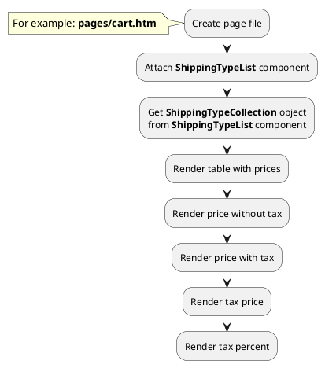

## Example {{ i }}: Render tax price of shipping type

### {{ i }}.1 Task

Create simple cart page and list of shipping types. Get prices of shipping types with tax and without tax.

### {{ i }}.2 How can i do it?

### {{ i }}.3 Source code

{{ get_module('tax').example('pages/cart-2.htm')|raw }}