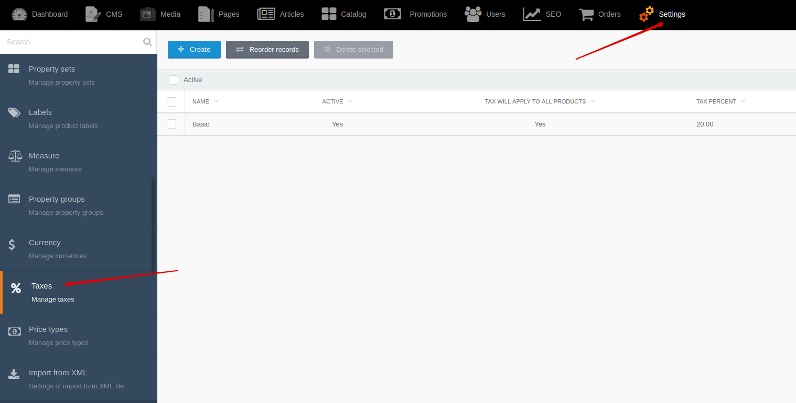
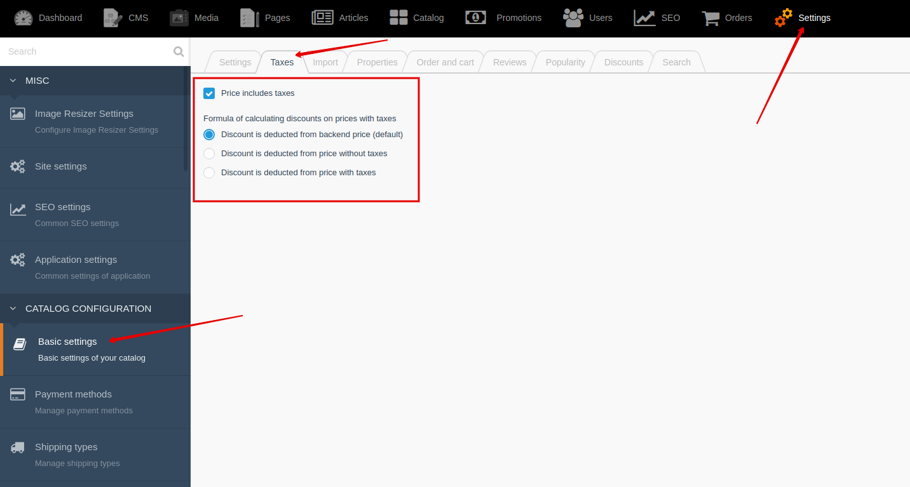

# Tax {docsify-ignore-all}

!> **Attention!**  We recommend that you read [Architecture](home.md#architecture), [ElementItem class](item-class/item-class.md),
[ElementCollection class](collection-class/collection-class.md) sections for complete understanding of  project architecture.

## Backend

You can create and edit taxes by going to **Backend -> Settings -> Taxes**

## Settings

You can flexibly configure taxes in your project.

Go to **Backend -> Settings -> Basic settings -> "Taxes" tab**

For example: **offer price is 39.99, tax percent is 20**.

||Backend price|Price without tax|Tax|Price with tax|
|---|---|---|---|---|
|Price includes taxes|**39.99**|33.33|6.66|**39.99**|
|Price does not includes taxes|**39.99**|**39.99**|8|47.99|

Example of calculation of discount after applying **coupon -7%**:

1. Price includes taxes

||Backend price|Calculation|Price without tax|Tax|Price with tax|
|---|---|---|---|---|---|
|Discount is deducted from backend price (default)|**39.99**|39.99 - 7% = 37.19|30.99|6.2|37.19|
|Discount is deducted from price without taxes|**39.99**|33.33 - 7% = 31|31|6.2|37.2|
|Discount is deducted from price with taxes|**39.99**|39.99 - 7% = 37.19|30.99|6.2|37.19|

1. Price does not includes taxes

||Backend price|Calculation|Price without tax|Tax|Price with tax|
|---|---|---|---|---|---|
|Discount is deducted from backend price (default)|**39.99**|39.99 - 7% = 37.19|37.19|7.44|44.63|
|Discount is deducted from price without taxes|**39.99**|39.99 - 7% = 37.19|37.19|7.44|44.63|
|Discount is deducted from price with taxes|**39.99**|47.99 - 7% = 44.63|37.19|7.44|44.63|