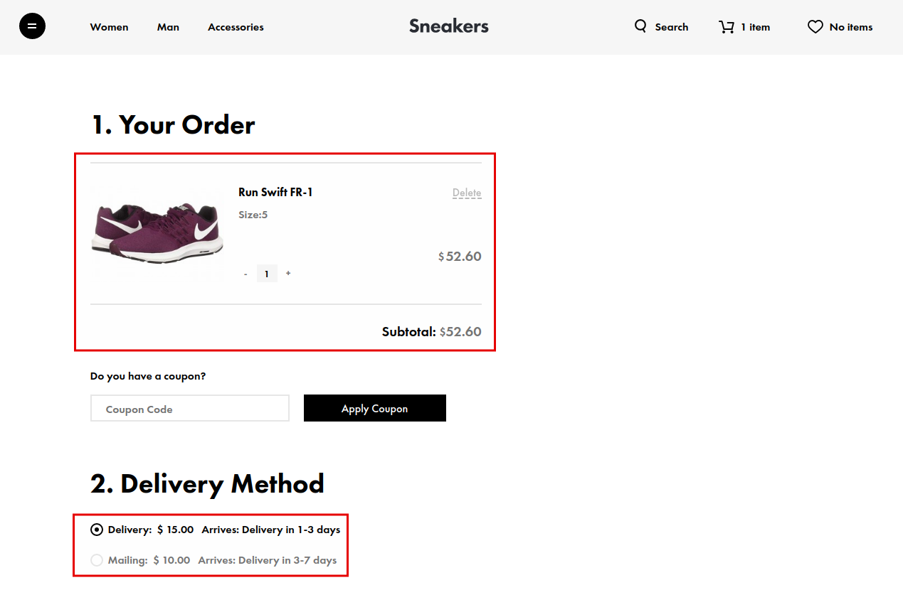
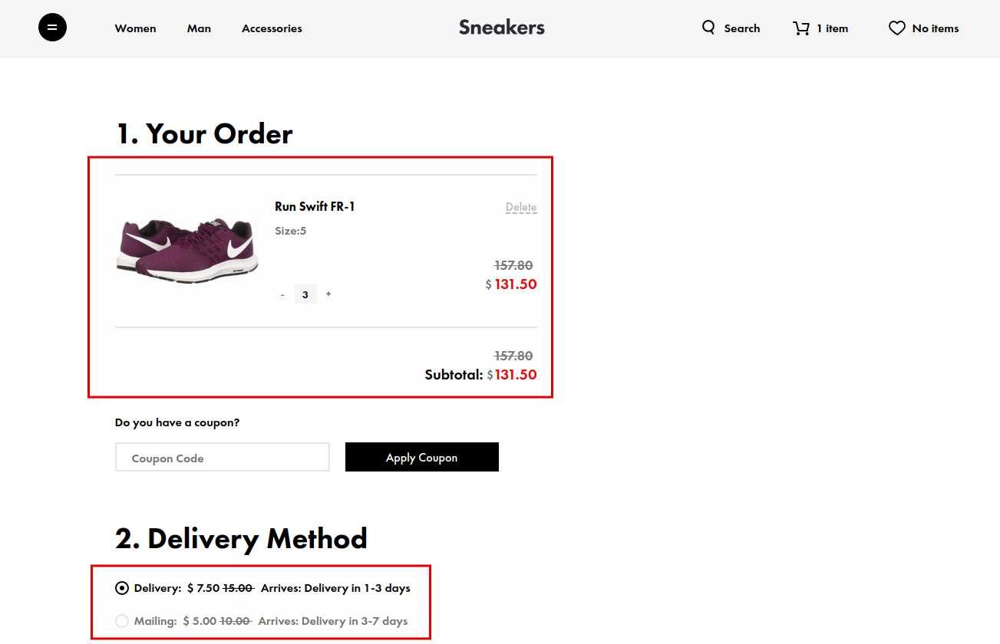
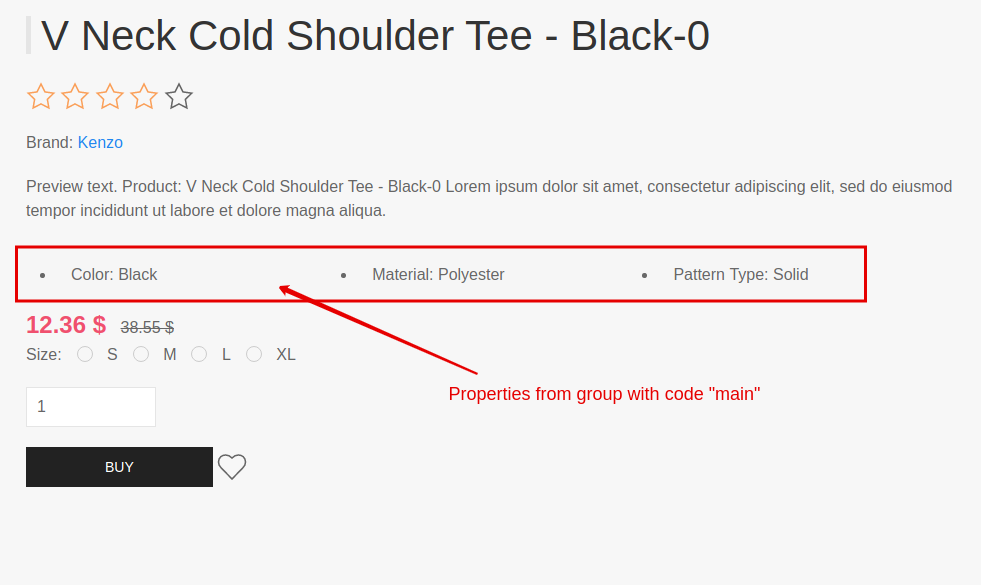
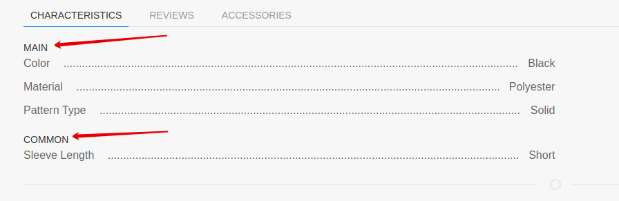

# Plugins end extensions

## Shopaholic plugin

Main plugin allows you to create simple catalog.
You can easily render product catalog page, product page, blocks with list of brands, content brand page,
blocks with list of promo blocks, promotions or sales, marketing pages with list of discounted products.

If your site only needs to display products, without making an order, then shopaholic plugin is perfect for solving this task.

Main plugin allows you to create/edit [brands](modules/brand/home.md), [categories](modules/category/home.md),
[products](modules/product/home.md), [offers](modules/offer/home.md), [unit measure](modules/measure/home.md), 
[promo blocks](modules/promo-block/home.md), [price types](modules/price-type/home.md),
[currencies](modules/currency/home.md), [taxes](modules/tax/home.md).

## Accessories for Shopaholic

Accessories plugin allows to bind products and assign them as an accessory to another product (for instance a mobile phone and headphones).
See more information about accessory module in [section](modules/accessory/home).

Plugin adds:
* "accessory" relation to [Product](modules/product/model/model) model
* "accessory" attribute to [ProductItem](modules/product/item/item) item class

## Campaigns for Shopaholic

“Campaigns” plugin allows you to automatically apply promo mechanisms to cart and orders according to your schedule.

For example:

## Compare for Shopaholic

The "Compare" plugin allows you to add products to the comparison list.
Users can view the comparison list, add products to compare list and remove products from the list.
The module now does not contain any complex logic for comparing product properties.

## Coupons for Shopaholic

Description will be added soon...

## Discounts for Shopaholic

"Discounts" plugin allows you to automatically update "price" and "old_price" fields of offers.

## Filter for Shopaholic

"Filter" plugin allows you to render a filtering panel and filter your products by price, brands and properties of products and offers.

## Labels for Shopaholic

“Labels” plugin allows you to mark products with such attributes as: “top”, “best seller”, “new”, etc.

## Orders for Shopaholic

Using [cart](modules/cart/home) module you will be able to allow users to add product offers to cart,
display cart positions (for example: mini-cart),
change quantity and remove positions from cart.

## Popularity for Shopaholic

"Popularity" plugin adds popularity to products.
Products with a higher popularity value will be higher than products with a lower popularity value.
You can change the value of the product’s popularity manually.

Product popularity can be increased automatically when costumer open product page, add the product to cart, and make an order.
You can specify count by which the product’s popularity will be increased.

## Properties for Shopaholic

The "Property" plugin allows you to render product and offer properties in different parts of the product page or product card.

You can display the offer selection block on the product page using the properties of the offers.

## Related products for Shopaholic

Related products plugin allows to bind products and assign them as an related to another product (for instance a mobile phone iPhone X and iPhone X MAX).
See more information about related products module in [section](modules/related-products/home). 

Plugin adds:
* "related" relation to [Product](modules/product/model/model) model
* "related" attribute to [ProductItem](modules/product/item/item) item class

## Reviews for Shopaholic

"Reviews" plugin allows you to place a feedback form on the product page.
You can display a list of collected reviews on the product page.
Review may contain a rating value.
The rating value is used to calculate the rating of the product and to sort the products by rating.

## Search for Shopaholic

Search for Shopaholic plugin allows to search products, categories, brands, tags by:
* name (product name);
* code (product code or vendor code);
* preview_text (preview text of product description);
* description (product description);
* search_synonym - allows to add search synonyms to certain keywords so customers can easily find elements by typing semantically related phrases;
* search_content - a field that is invisible to the user in backend and allows developer to automatically place searchable content.

See more information about search module in [section](modules/search/home).

Plugin adds:
* "search" method to [ProductCollection](modules/product/collection/collection#searchssearchstring) collection class
* "search" method to [BrandCollection](modules/brand/collection/collection#searchssearchstring) collection class
* "search" method to [CategoryCollection](modules/category/collection/collection#searchssearchstring) collection class
* "search" method to [TagCollection](modules/tag/collection/collection#searchssearchstring) collection class

## Sphinx for Shopaholic

You can use [Sphinx](http://sphinxsearch.com/) to add full-text search on your site.
Sphinx for Shopaholic plugin allows to search products, categories, brands, tags by:
* name (product name);
* code (product code or vendor code);
* preview_text (preview text of product description);
* description (product description);
* search_synonym - allows to add search synonyms to certain keywords so customers can easily find elements by typing semantically related phrases;
* search_content - a field that is invisible to the user in backend and allows developer to automatically place searchable content.

See more information about search module in [section](modules/search/sphinx/sphinx).

Plugin adds:
* "search" method to [ProductCollection](modules/product/collection/collection#searchssearchstring) collection class
* "search" method to [BrandCollection](modules/brand/collection/collection#searchssearchstring) collection class
* "search" method to [CategoryCollection](modules/category/collection/collection#searchssearchstring) collection class
* "search" method to [TagCollection](modules/tag/collection/collection#searchssearchstring) collection class

## Subscriptions for Shopaholic

Using "Subscriptions for Shopaholic" plugin you can sell products with a subscription sales model.
User will be able to buy products for a certain period, renew their current subscription, and see their purchased subscriptions.

You can give access to any custom model (for example "Article" model). This will give you opportunity to give access to paid content, such as an article in paid journal.

See more information about subscriptions module in [section](modules/subscription/home).

Plugin adds:
* [Subscription access](modules/subscription-access/home.md) module
* [Subscription period](modules/subscription-period/home.md) module
* "is_subscription" field to [Product](modules/product/model/model) model
* "subscription_period" relation to [Offer](modules/offer/model/model) model
* "subscription_period" attribute to [OfferItem](modules/offer/item/item) item class
* "sortByPeriod" method to [OfferCollection](modules/offer/collection/collection#sortbyperiod) class
* "is_subscription", "subscription_access_id", "subscription_period_id" fields to [OrderPosition](modules/order-position/model/model) model
* "subscription_access", "subscription_period" relations to [OrderPosition](modules/order-position/model/model) model
* "expire_at", "subscription_access", "subscription_period" attributes to [OrderPositionItem](modules/order-position/item/item) class
* "checkAccessToSubscription", "findAccessToSubscription" attributes to [User](modules/user/model/model) model
* "checkAccessToSubscription", "findAccessToSubscription", "subscription_access" attributes to [UserItem](modules/user/item/item) class

## Tags for Shopaholic

"Tags" plugin allows you to create seo pages with a list of products within a single category.
Tag can only be linked to one category.

## Viewed products for Shopaholic

The "Viewed products" plugin allows you to add automatically products to the viewed products list.
Users can view the product list and remove products from the viewed products list.

## VK Goods for Shopaholic

Description will be added soon...

## Wish list for Shopaholic

The "Wish list" plugin allows you to add products to the wish list.
Users can view the wish list, add products to wish list, remove products from wish list.

## Yandex Market for Shopaholic

Description will be added soon...