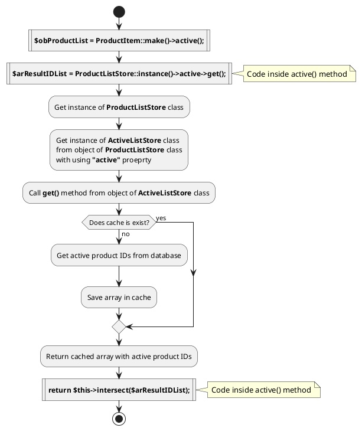
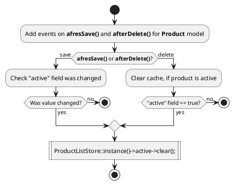

# Store class {docsify-ignore-all}

Store classes are used to store cached lists of element IDs.

## Logical diagram

Logical diagram of initialization of new ProductCollection object and getting list of active product



Logical diagram of cache clearing active of active product



## AbstractStoreWithoutParam

AbstractStoreWithoutParam class allows you to quickly create store that do not use parameters in database query.
For example: caching list of active brands.

```php
<?php namespace Lovata\Shopaholic\Classes\Store\Brand;

use Lovata\Toolbox\Classes\Store\AbstractStoreWithoutParam;

use Lovata\Shopaholic\Models\Brand;

/**
 * Class ActiveListStore
 * @package Lovata\Shopaholic\Classes\Store\Brand
 */
class ActiveListStore extends AbstractStoreWithoutParam
{
    protected static $instance;

    /**
     * Get ID list from database
     * @return array
     */
    protected function getIDListFromDB() : array
    {
        $arElementIDList = (array) Brand::active()->lists('id');

        return $arElementIDList;
    }
}
```

## AbstractStoreWithParam

AbstractStoreWithParam class allows you to quickly create store that do use one parameter in database query.
For example: caching list of products with filter by brand ID.

```php
<?php namespace Lovata\Shopaholic\Classes\Store\Product;

use Lovata\Toolbox\Classes\Store\AbstractStoreWithParam;

use Lovata\Shopaholic\Models\Product;

/**
 * Class ListByBrandStore
 * @package Lovata\Shopaholic\Classes\Store\Product
 */
class ListByBrandStore extends AbstractStoreWithParam
{
    protected static $instance;

    /**
     * Get ID list from database
     * @return array
     */
    protected function getIDListFromDB() : array
    {
        $arElementIDList = (array) Product::getByBrand($this->sValue)->lists('id');

        return $arElementIDList;
    }
}
```

## AbstractStoreWithTwoParam

AbstractStoreWithTwoParam class allows you to quickly create store that do use two parameters in database query.
For example: caching list of orders with filter by status ID and user ID.


```php
<?php namespace Lovata\OrdersShopaholic\Classes\Store\Order;

use Lovata\Toolbox\Classes\Store\AbstractStoreWithTwoParam;

use Lovata\OrdersShopaholic\Models\Order;

/**
 * Class SortingListStore
 * @package Lovata\OrdersShopaholic\Classes\Store\Order
 */
class StatusListStore extends AbstractStoreWithTwoParam
{
    protected static $instance;

    /**
     * Get ID list from database
     * @return array
     */
    protected function getIDListFromDB() : array
    {
        if (empty($this->sAdditionParam)) {
            $arElementIDList = (array) Order::getByStatus($this->sValue)->lists('id');
        } else {
            $arElementIDList = (array) Order::getByUser($this->sAdditionParam)->getByStatus($this->sValue)->lists('id');
        }

        return $arElementIDList;
    }
}
```